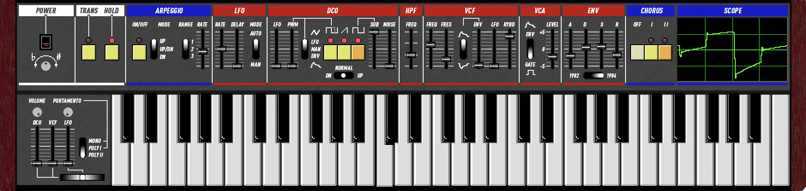

# Ultramaster KR-106

[](https://github.com/kayrockscreenprinting/ultramaster_kr106/actions/workflows/release.yml)
[](LICENSE)

A synthesizer plugin emulating the Roland Juno-106, built with [JUCE](https://juce.com/).



6-voice polyphonic with per-voice analog variance, TPT ladder filter with OTA saturation,
BBD chorus emulation, arpeggiator, portamento/unison mode, and 211 factory presets.

**Formats:** AU, VST3, LV2, Standalone
**Platforms:** macOS (13+), Windows, Linux

**[Download latest release](https://github.com/kayrockscreenprinting/ultramaster_kr106/releases/latest)**

See [docs/DSP_ARCHITECTURE.md](docs/DSP_ARCHITECTURE.md) for a detailed writeup of the
signal chain and emulation techniques.

## Building

### macOS

Requires **CMake** (3.22+) and **Xcode** (or Command Line Tools).

```bash
git clone --recursive https://github.com/kayrockscreenprinting/ultramaster_kr106.git
cd ultramaster_kr106
make build    # AU, VST3, Standalone
make run      # Build and launch Standalone
```

### Windows

Requires **CMake** (3.22+) and **Visual Studio 2022** (or Build Tools with C++ workload).

```bash
git clone --recursive https://github.com/kayrockscreenprinting/ultramaster_kr106.git
cd ultramaster_kr106
cmake -B build
cmake --build build --config Release
```

Plugins are output to `build/KR106_artefacts/Release/`.

### Linux

Requires **CMake** (3.22+) and a C++17 compiler.

```bash
git clone --recursive https://github.com/kayrockscreenprinting/ultramaster_kr106.git
cd ultramaster_kr106
make deps     # Install ALSA, X11, freetype, etc. (apt)
make build    # VST3, LV2, Standalone
```

For a release build:

```bash
CONFIG=Release make build
```

Run `make help` for all available targets.

## Project Structure

```
Source/
  PluginProcessor.cpp/h        Audio processor, parameter setup, preset management
  PluginEditor.cpp/h           Custom GUI layout
  KR106_Presets_JUCE.h         211 factory presets

  Controls/
    KR106Knob.h                Bitmap rotary knob (sprite sheet)
    KR106Slider.h              Pixel-perfect vertical fader
    KR106Switch.h              3-way toggle switch (vertical/horizontal)
    KR106Button.h              Momentary button with LED
    KR106Keyboard.h            On-screen keyboard with transpose
    KR106Scope.h               Oscilloscope with clickable vertical zoom
    KR106Bender.h              Pitch bend lever
    KR106Tooltip.h             Parameter value tooltip overlay

  DSP/
    KR106_DSP.h                Top-level DSP orchestrator, HPF, signal routing
    KR106Voice.h               Per-voice: VCF, ADSR, oscillator mixing, portamento
    KR106Oscillators.h         PolyBLEP saw, pulse, sub, noise generators
    KR106Chorus.h              MN3009 BBD chorus with Hermite interpolation
    KR106LFO.h                 Global triangle LFO with delay envelope
    KR106Arpeggiator.h         Note sequencer (Up / Down / Up-Down)

docs/
  DSP_ARCHITECTURE.md          Detailed DSP design documentation
  HOLD_ARP_FLOW.md             Hold + arpeggiator interaction flow

tools/preset-gen/              Original patch files and conversion utilities
```

## Contributing

See [CONTRIBUTING.md](CONTRIBUTING.md) for guidelines on submitting issues and pull requests.

## License

This project is licensed under the [GNU General Public License v3.0](LICENSE).
Third-party library licenses are listed in [THIRD_PARTY_LICENSES](THIRD_PARTY_LICENSES).
